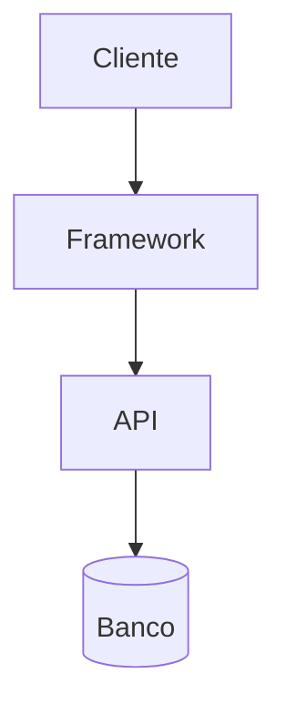
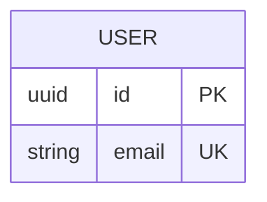

# Skill: Bootstrap de Projeto — PRD Template

> Carregar ao iniciar projeto novo. Preencher antes de criar a primeira task em `tasks.md`.
> Após preenchimento, salvar como `.claude/prd.md`.

---

## 1. Visão do Produto

**Problema central:** [Uma frase descrevendo a dor.]
**Quem sofre:** [Público-alvo específico.]
**Como é resolvido hoje:** [Soluções existentes ou "não é resolvido".]

**Proposta de solução:** [Resultado entregue ao usuário, não implementação.]
**Diferencial:** [Por que melhor que alternativas.]

### Critérios de Sucesso

| Métrica | Alvo | Como medir |
|---------|------|------------|
| | | |

## 2. Escopo Funcional

### MVP (must-have primeiro, max 8-10 itens)

| # | Funcionalidade | Descrição (ponto de vista do usuário) | Prioridade | Complexidade |
|---|----------------|---------------------------------------|------------|--------------|
| F-001 | | | must-have | minor/major |

**Prioridades:** must-have (sem isso não funciona), should-have (importante, MVP sobrevive sem), nice-to-have (pós-MVP).

### Pós-MVP

| # | Funcionalidade | Descrição | Dependência |
|---|----------------|-----------|-------------|
| F-100 | | | |

### Fora de Escopo

- [O que o projeto NÃO faz — protege contra scope creep.]

## 3. Stack Técnica

| Camada | Tecnologia | Versão | Justificativa |
|--------|-----------|--------|---------------|
| Linguagem | | | |
| Framework | | | |
| Banco de dados | | | |
| Autenticação | | | |
| Hospedagem | | | |
| Testes | | | |

### Dependências Críticas

| Dependência | Uso | Risco se indisponível | Alternativa |
|-------------|-----|----------------------|-------------|
| | | | |

### Variáveis de Ambiente

```env
# .env.example
```

## 4. Arquitetura

[Descreva: monolito/micro, camadas principais, fluxo de dados.]



### Estrutura de Diretórios

```
src/
├── ...
```

### Modelo de Dados



## 5. Viabilidade

### Técnica

| Aspecto | Avaliação | Observações |
|---------|-----------|-------------|
| Stack suporta MVP? | ✓/✗/parcial | |
| Dev domina a stack? | ✓/✗/parcial | |
| Limitações conhecidas? | sim/não | |

### Prazo

| Fase | Estimativa |
|------|------------|
| Setup + TASK-000 | |
| Fundação (auth, modelo, layout) | |
| Core (must-have) | |
| Polimento (testes, UX) | |
| Deploy | |
| **Total** | |

### Custo Mensal

| Serviço | Plano | Custo | Limite |
|---------|-------|-------|--------|
| | | | |

### Riscos

| Risco | Probabilidade | Impacto | Mitigação |
|-------|--------------|---------|-----------|
| | | | |

## 6. Fluxos de Usuário (MVP)

### Fluxo: [Nome]
```
[Passo 1] → [Passo 2] → [Resultado]
```
**Sucesso:** [o que acontece]
**Erro:** [como o sistema se comporta]

## 7. Decomposição em Tasks

| Ordem | Task | Funcionalidade | Complexidade | Dependência |
|-------|------|----------------|--------------|-------------|
| 1 | TASK-000: Bootstrap | — | major | — |
| 2 | TASK-001: | | | TASK-000 |

## 8. Decisões em Aberto

| # | Questão | Impacto | Prazo | Decisão |
|---|---------|---------|-------|---------|
| D-001 | | | | pendente |

---

| Data | Alteração | Autor |
|------|-----------|-------|
| | Versão inicial | |
